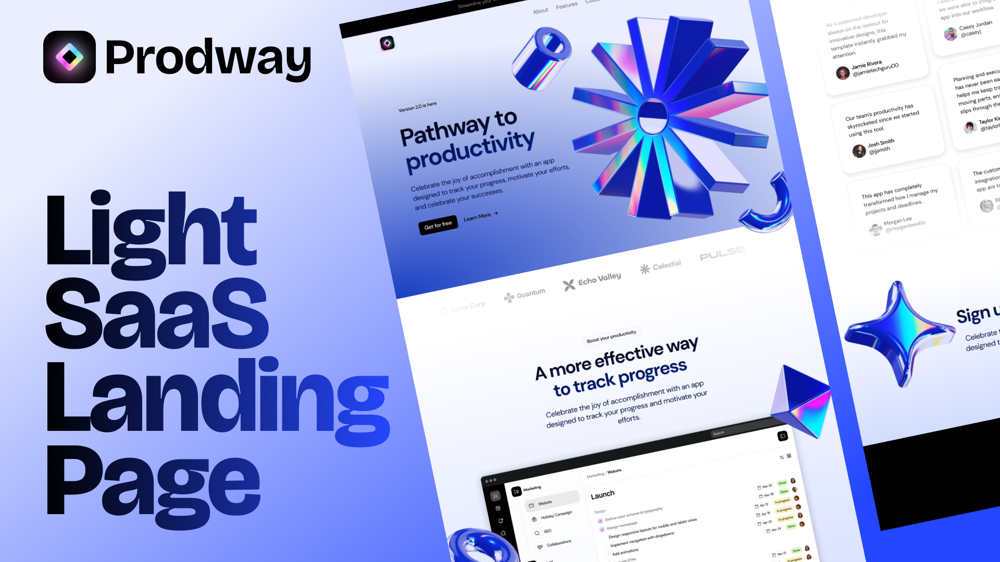

# Prodway

<br>

Prodway is a modern, light SaaS landing page designed using React, Next.js, TailwindCSS, and Framer Motion. This project aims to provide a fast, responsive, and SEO-optimized landing page that is easy to customize and built with the latest web technologies. This is a [Next.js](https://nextjs.org/) project bootstrapped with [`create-next-app`](https://github.com/vercel/next.js/tree/canary/packages/create-next-app).


## Features
- **Fast and Responsive**: Optimized for performance and mobile-friendly design.
- **SEO Optimized**: Built with best practices to ensure high search engine rankings.
- **Easy to Customize**: Modular and well-documented codebase for easy customization.
- **Modern Technologies**: Developed using React, Next.js, TailwindCSS, and Framer Motion.
- **Animated**: Smooth animations and transitions powered by Framer Motion.
- **Cross-Browser Compatibility**: Works seamlessly across different browsers.
- **Accessibility**: Designed with accessibility in mind to ensure inclusivity.
- **Scalable Architecture**: Built to handle growth and scalability.

## Getting Started

First, run the development server:

```bash
npm run dev
# or
yarn dev
# or
pnpm dev
# or
bun dev
```

Open [http://localhost:3000](http://localhost:3000) with your browser to see the result.

You can start editing the page by modifying `app/page.tsx`. The page auto-updates as you edit the file.

This project uses [`next/font`](https://nextjs.org/docs/basic-features/font-optimization) to automatically optimize and load DM_Sans, a custom Google Font.

## Installation

To install the project dependencies, run:

```bash
npm install
# or
yarn install
# or
pnpm install
# or
bun install
```

## Usage

After installation, you can start the development server:

```bash
npm run dev
# or
yarn dev
# or
pnpm dev
# or
bun dev
```

## Design

You can view the design for this project on Figma: [Light SaaS Landing Page](https://www.figma.com/design/QVurC59vEGp58v3RGPK0S4/Light-SaaS-Landing-Page?node-id=0-1&t=MNqnEiakPaFbjw28-1)

## Contributing

Contributions are welcome! Please read the [contributing guidelines](CONTRIBUTING.md) first.

## License

This project is licensed under the MIT License. See the [LICENSE](LICENSE) file for details.

